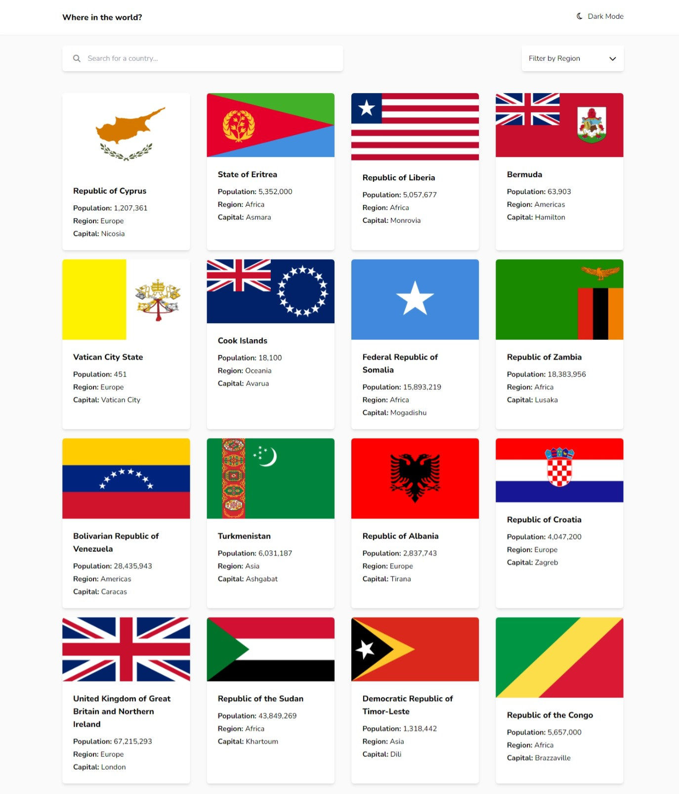
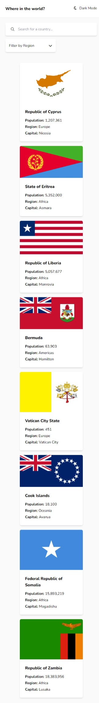
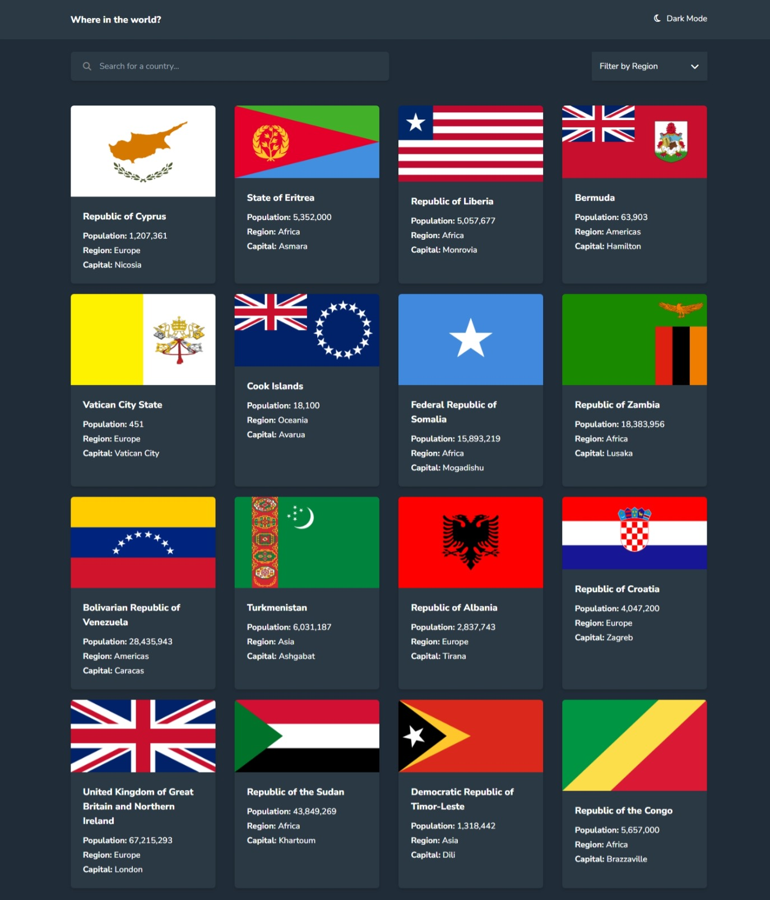
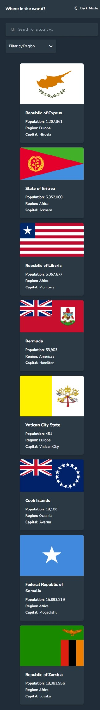

# Frontend Mentor - REST Countries API with color theme switcher solution

This is a solution to the [REST Countries API with color theme switcher challenge on Frontend Mentor](https://www.frontendmentor.io/challenges/rest-countries-api-with-color-theme-switcher-5cacc469fec04111f7b848ca).

## Table of contents

- [Overview](#overview)
  - [The challenge](#the-challenge)
  - [Links](#links)
  - [Screenshot](#screenshot)
- [My process](#my-process)
  - [What I learned](#what-i-learned)

## Overview

### The challenge

Users should be able to:

- See all countries from the API on the homepage
- Search for a country using an `input` field
- Filter countries by region
- Click on a country to see more detailed information on a separate page
- Click through to the border countries on the detail page
- Toggle the color scheme between light and dark mode *(optional)*

### Links

- [Live Site URL](https://xdv99.github.io/rest-countries-api-with-color-theme-switcher-master/)

### Screenshot
|       Desktop Design        |       Mobile Design        |
| ------------- | ------------- |
  |  |
|  |  |

## My process

### What I learned

Doing many dom manipulation with pure JS is pretty hard and I think that is why **Reac** is in the business.

